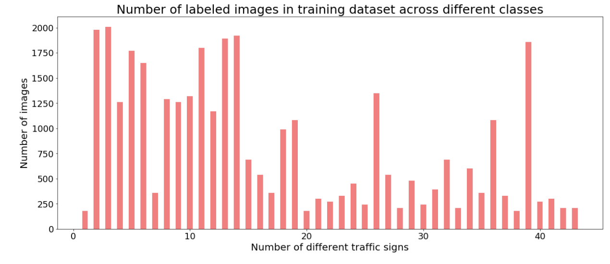
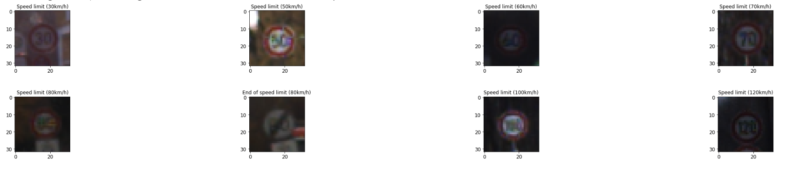
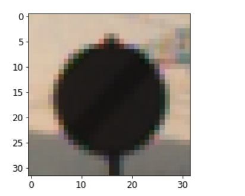
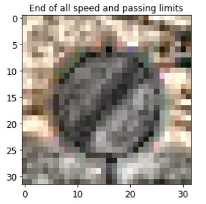

## Project: Build a Traffic Sign Recognition Program

Overview
---
In this project, you will use what you've learned about deep neural networks and convolutional neural networks to classify traffic signs. You will train and validate a model so it can classify traffic sign images using the [German Traffic Sign Dataset](http://benchmark.ini.rub.de/?section=gtsrb&subsection=dataset). After the model is trained, you will then try out your model on images of German traffic signs that you find on the web.

Solution
---
We first start with basic analysis of training data set. There are a little less than 52k images, split into training, validation and test sets.

Our traffic signs belong to 43 different classes and image below shows the distribution of our training set:

From the picture it is clear that few classes have large number of labeled images and a few of classes have labeled images less than 500 in each class. This gives hint to augmentation, as suggested in video lectures, deep learning network shines with more data.
Actual labels for dataset are provided in signnames.csv file, let’s look how images from few class look like. 

Data Preprocessing
---
As a first step, with images in dataset from different lighting conditions, it is necessary to normalize them such that they will have good intensity level distribution on histogram.
Before Normalization:  
   

After Contrast Limited Adaptive Histogram Equalization:  
  
Contrast Limited Adaptive Histogram Equalization(CLAHE) method is pretty promising and provides great normalization in different lighting conditions.Since we are interested in brightness factor, CLAHE is applied to only Y channel by converting image to YUV.

Augmentation
---
After exploring data-set and trying NN without data augmentation, to make model more reliable and predictable, data augmentation is implemented. Few of classes don't have enough number of images and it is necessary to produce images using this technique. Images from ImageDataGenerator from Keras is a convenient option to augment data with variation in following parameters:
1. Angle of rotation
2. Shift in height
3. Shift in width
4. Shear range
5. Zoom range

Per class 4000 images are augmented..! Now, the data set with these variation and number of images per class looks great..!

Model Architecture
---
Final model consisted of the following layers:

| Layer1         		|     Description	        					|
|:---------------------:|:---------------------------------------------:|
| Input         		| 32x32x3 RGB image   							|
| Convolution       	| 1x1 stride, valid padding, outputs 28x28x6 	|
| RELU					|												|
| Max pooling	      	| 1x1 stride,  outputs 14x14x6  				|

| Layer2         		|     Description	        					|
|:---------------------:|:---------------------------------------------:|
| Convolution       	| 1x1 stride, valid padding, outputs 10x10x16 	|
| RELU					|												|
| Max pooling	      	| 1x1 stride,  outputs 5x5x16 		  		    |

| Layer3         		|     Description	        					|
|:---------------------:|:---------------------------------------------:|
| Fully Conn(matmul)  	| 120 output   							        |
| RELU                  |                                               |

| Layer4         		|     Description	        					|
|:---------------------:|:---------------------------------------------:|
| Fully Conn(matmul)  	| 84 output   							        |
| RELU                  |                                               |

| Layer5         		|     Description	        					|
|:---------------------:|:---------------------------------------------:|
| Fully Conn(matmul)  	| 43 output   							        |
| RELU                  |                                               |

Training
---
This part took quite lot of efforts for me. It was difficult to tune combination of hyperparameters learning rate,optimizer, batch size, keep_prob.
Learning rate is very sensitive hyperparameter and I tried learning rate from 0.05 to 0.0005 to understand impact.
Early termination is good idea, however when you see validation/training accuracy increasing it's lucrative to set number of epochs to high number. I finally limited number of epochs to 20 instead of 30 after observing steadiness in accuracy.
Batch size didn't affect much for this specific NN, I tried tuning it to 64,128,256. Best result obtained for batch size of 128. 
Optimizer is one of the crucial hyperparameters, and most interesting to me. I explored a lot about different optimizers like stockastic gradient descent, Adagrad, Adam optimizer, momentum, etc. Adagrad and Adam provided best results, Adagrad took more epochs to reach high accuracy and hence I ended up using Adam optimizer.

Results
---
Results after 20 Epochs:
* training set accuracy of 96.4%
* validation set accuracy of 95.1%
* test set accuracy of 93.1%

Test set predictions were just above 93% accurate. This is good confidence level, there is much scope for improvement for reaching accuracy of test result up to 100%.

Here, is the highest probability numbers from top 5. As probability numbers are greater than 0.99, I am pretty confident that model is working as expected for basic images.

| Probability         	| |     Prediction	        					|
|:---------------------:| |:-------------------------------------------:|
| .99         			| |Yield   									    |
| .99     				| |Keep Left 									|
| .92					| |Vehicles over 3.5 ton prohibitted			|
| .99	      			| |Road Work 					 				|
| .99				    | |Pedestrian        							|
